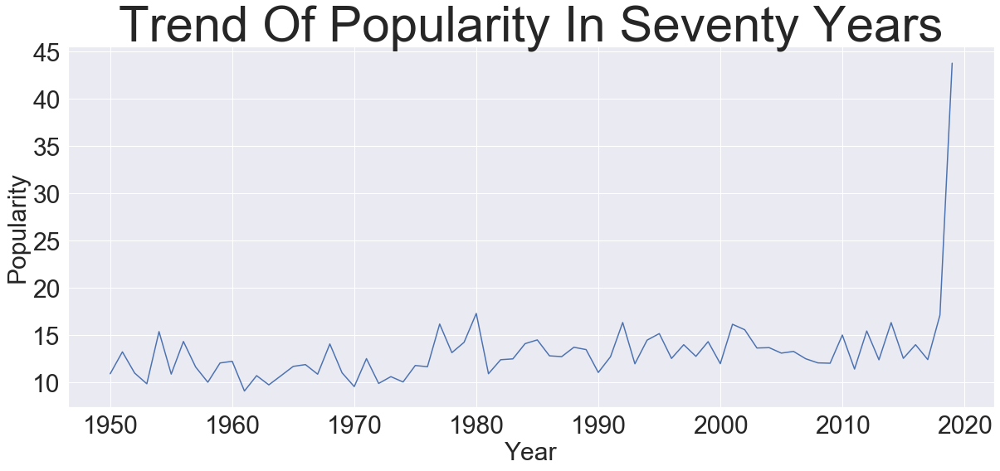
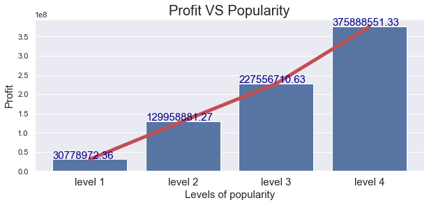
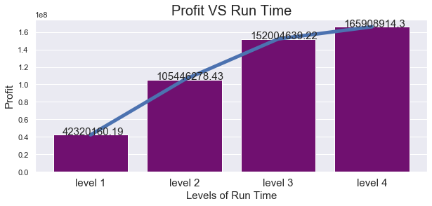
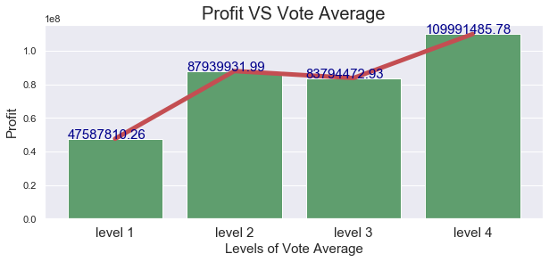
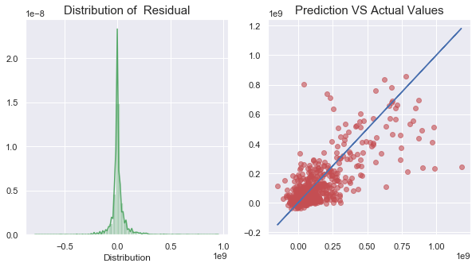

## Project Title:
The_movie_db_API_Linear_Regression_Analysis

## Goal:
The goal of the project is to use the data from api.themoviedb.org and the multiple linear models to predict the movie gross
and to show more insights of this dataset

## Attribute information 
- Gross profit  =Revenue - budget
- Popularity
- Vote_avarage
- Vote_count
- Genres
- Runtime
## EDA
- We can see the average of total movie popularity slightly increased before 2019, however after 2019 popularity increased dramatically.
- Higher popularity higher profit
- 'Runtime' does not affect profit significantly , because 'runtime' has limit. For example, a movie's runtime cannot longger than 5 hours or 24 hours. Mean of runtime is around 2 hours. If a movie runtime is very long, people will feel tidious.
- Higher vote_average higher profit 

## Models: 
- Regular Linear Regression
- Ridge Regression
- Lasso Regression
- Neural Network  
## Model Evaluation:

- Based on RMSE and (R^2) score to evaluate the best model is Neural Network 

